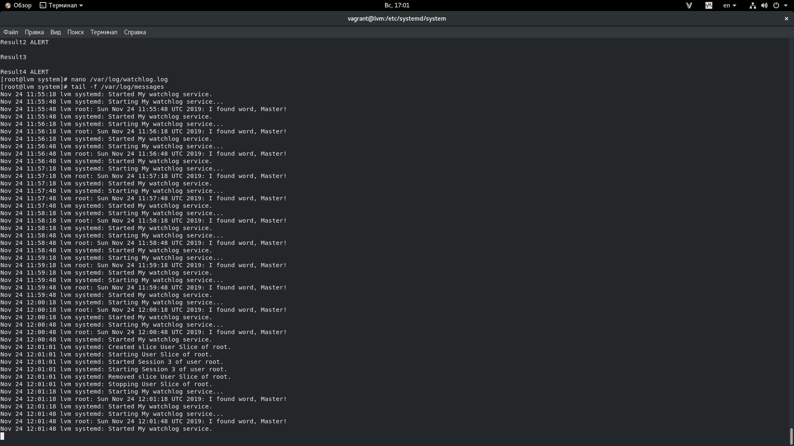
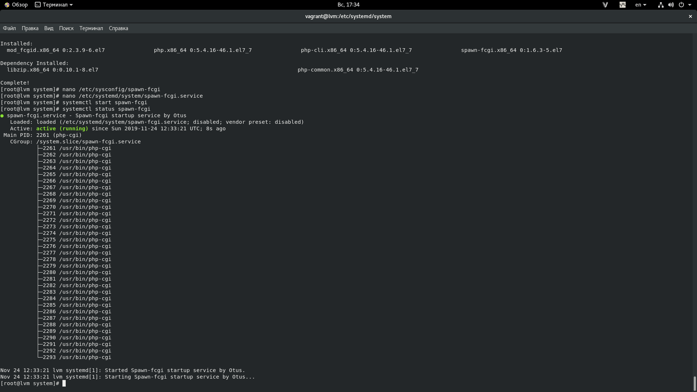

# Homework5
==============================

### 1. Написать сервис, который будет раз в 30 секунд мониторить лог на предмет наличия ключевого слова. Файл и слово должны задаваться в /etc/sysconfig

1. Cоздаём файл с конфигурацией для сервиса в директории /etc/sysconfig 

        nano /etc/sysconfig/watchlog
        
   _Содержимое:_
   
        # Configuration file for my watchdog service
        # Place it to /etc/sysconfig

        # File and word in that file that we will be monit
        WORD="ALERT"
        LOG=/var/log/watchlog.log
        
 2. Создаем /var/log/watchlog.log и пишем туда строки на своё усмотрение, плюс ключевое слово ‘ALERT’
 
         nano /var/log/watchlog.log
         
 3. Создадим скрипт /opt/watchlog.sh
 
         #!/bin/bash
         WORD=$1
         LOG=$2
         DATE=`date`

         if grep $WORD $LOG &> /dev/null
         then
             logger "$DATE: I found word, Master!"
         else
             exit 0
         fi
         
 4. Создаем юниты для сервиса в /usr/lib/systemd/system/
 
 _wachlog.service_
 
         [Unit]
         Description=My watchlog service

         [Service]
         Type=oneshot
         EnvironmentFile=/etc/sysconfig/watchlog
         ExecStart=/opt/watchlog.sh $WORD $LOG 
 
 _wacthlog.timer_
 
         [Unit]
         Description=Run watchlog script every 30 second

         [Timer]
         # Run every 30 second
         OnUnitActiveSec=30
         Unit=watchlog.service

         [Install]
         WantedBy=multi-user.target
 
 5. Стартуем timer
 
         systemctl start watchlog.timer
         
 6. Проверяем результат
 
         tail -f /var/log/messages
         
         
 
 
 
 ## 2.Из epel установить spawn-fcgi и переписать init-скрипт на unit-файл. Имя сервиса должно также называться.
 
 1. Устанавливаем spawn-fcgi и необходимые для него пакеты 
 
        yum install epel-release -y && yum install spawn-fcgi php php-cli mod_fcgid httpd -y
         
 2. Раскомментируем строки с переменными в /etc/sysconfig/spawn-fcgi

        # You must set some working options before the "spawn-fcgi" service will work.
        # If SOCKET points to a file, then this file is cleaned up by the init script.
        #
        # See spawn-fcgi(1) for all possible options.
        #
        # Example :
        SOCKET=/var/run/php-fcgi.sock
        OPTIONS="-u apache -g apache -s $SOCKET -S -M 0600 -C 32 -F 1 -P /var/run/spawn-fcgi.pid -- /usr/bin/php-cgi"
        
 3. Создаем юнит файл /etc/systemd/system/spawn-fcgi.service
 
        [Unit]
        Description=Spawn-fcgi startup service by Otus
        After=network.target

        [Service]
        Type=simple
        PIDFile=/var/run/spawn-fcgi.pid
        EnvironmentFile=/etc/sysconfig/spawn-fcgi
        ExecStart=/usr/bin/spawn-fcgi -n $OPTIONS
        KillMode=process

        [Install]
        WantedBy=multi-user.target
        
  4. Тестируем
  
                systemctl start spawn-fcgi
                systemctl status spawn-fcgi
                ● spawn-fcgi.service - Spawn-fcgi startup service by Otus
                   Loaded: loaded (/etc/systemd/system/spawn-fcgi.service; disabled; vendor preset: disabled)
                   Active: active (running) since Sun 2019-11-24 12:33:21 UTC; 8s ago
                 Main PID: 2261 (php-cgi)
                   CGroup: /system.slice/spawn-fcgi.service
                           ├─2261 /usr/bin/php-cgi
                           ├─2262 /usr/bin/php-cgi
                           ├─2263 /usr/bin/php-cgi
                           ├─2264 /usr/bin/php-cgi
                           ├─2265 /usr/bin/php-cgi
                           ├─2266 /usr/bin/php-cgi
                           ├─2267 /usr/bin/php-cgi
                           ├─2268 /usr/bin/php-cgi
                           ├─2269 /usr/bin/php-cgi
                           ├─2270 /usr/bin/php-cgi
                           ├─2271 /usr/bin/php-cgi
                           ├─2272 /usr/bin/php-cgi
                           ├─2273 /usr/bin/php-cgi
                           ├─2274 /usr/bin/php-cgi
                           ├─2275 /usr/bin/php-cgi
                           ├─2276 /usr/bin/php-cgi
                           ├─2277 /usr/bin/php-cgi
                           ├─2278 /usr/bin/php-cgi
                           ├─2279 /usr/bin/php-cgi
                           ├─2280 /usr/bin/php-cgi
                           ├─2281 /usr/bin/php-cgi
                           ├─2282 /usr/bin/php-cgi
                           ├─2283 /usr/bin/php-cgi
                           ├─2284 /usr/bin/php-cgi
                           ├─2285 /usr/bin/php-cgi
                           ├─2286 /usr/bin/php-cgi
                           ├─2287 /usr/bin/php-cgi
                           ├─2288 /usr/bin/php-cgi
                           ├─2289 /usr/bin/php-cgi
                           ├─2290 /usr/bin/php-cgi
                           ├─2291 /usr/bin/php-cgi
                           ├─2292 /usr/bin/php-cgi
                           └─2293 /usr/bin/php-cgi

                Nov 24 12:33:21 lvm systemd[1]: Started Spawn-fcgi startup service by Otus.
                Nov 24 12:33:21 lvm systemd[1]: Starting Spawn-fcgi startup service by Otus...

 

## 3. Дополнить юнит-файл apache httpd возможностью запустить несколько инстансов сервера с разными конфигами

1. Копируем cp /usr/lib/systemd/system/httpd.service /etc/systemd/system/httpd@.service

        [Unit]
        Description=The Apache HTTP Server
        After=network.target remote-fs.target nss-lookup.target
        Documentation=man:httpd(8)
        Documentation=man:apachectl(8)

        [Service]
        Type=notify
        EnvironmentFile=/etc/sysconfig/httpd-%I
        ExecStart=/usr/sbin/httpd $OPTIONS -DFOREGROUND
        ExecReload=/usr/sbin/httpd $OPTIONS -k graceful
        ExecStop=/bin/kill -WINCH ${MAINPID}
        # We want systemd to give httpd some time to finish gracefully, but still want
        # it to kill httpd after TimeoutStopSec if something went wrong during the
        # graceful stop. Normally, Systemd sends SIGTERM signal right after the
        # ExecStop, which would kill httpd. We are sending useless SIGCONT here to give
        # httpd time to finish.
        KillSignal=SIGCONT
        PrivateTmp=true

        [Install]
        WantedBy=multi-user.target

2. Создаем конфиги

        # /etc/sysconfig/httpd-first
        OPTIONS=-f conf/first.conf

        # /etc/sysconfig/httpd-second
        OPTIONS=-f conf/second.conf

